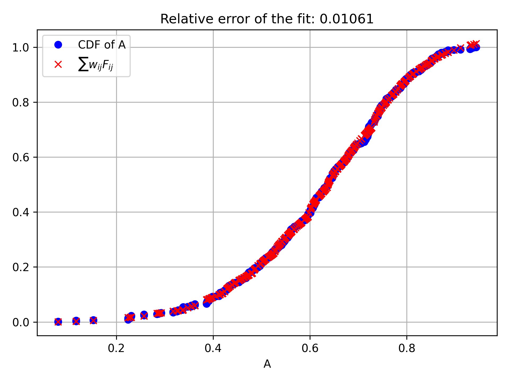
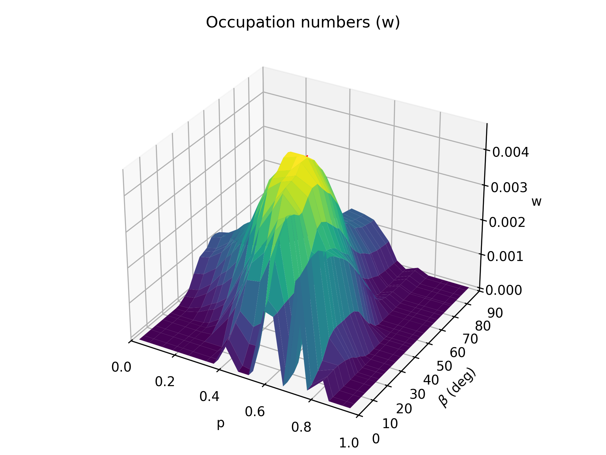
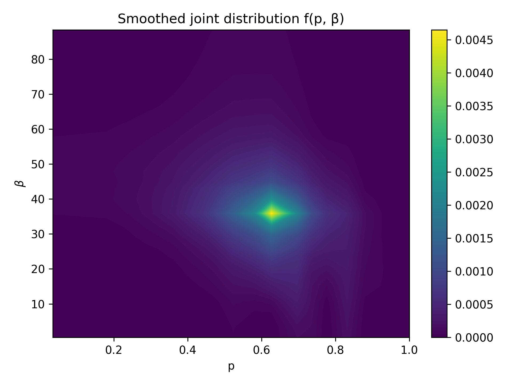
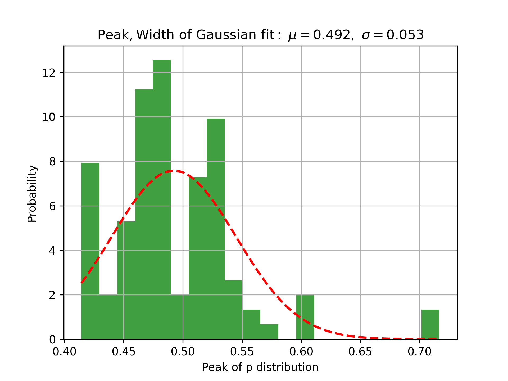
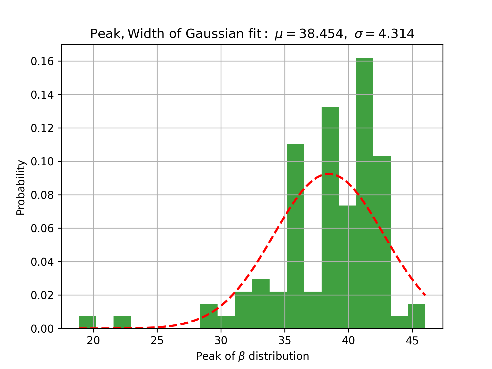
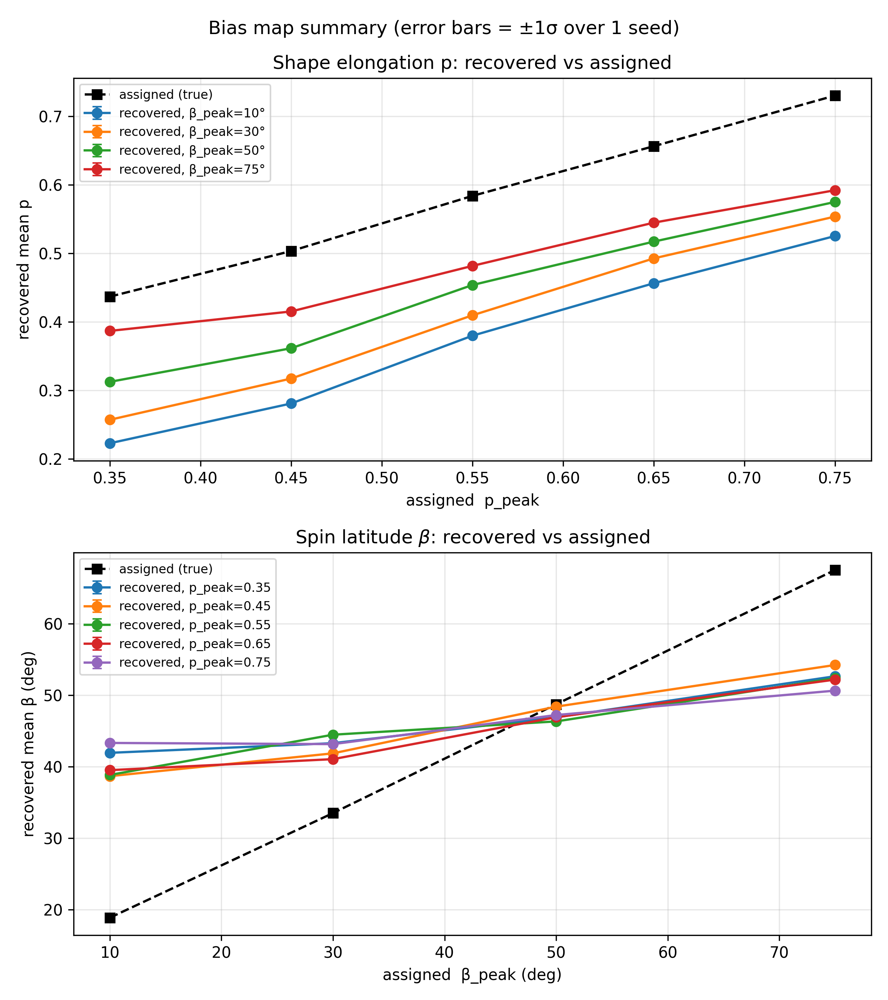
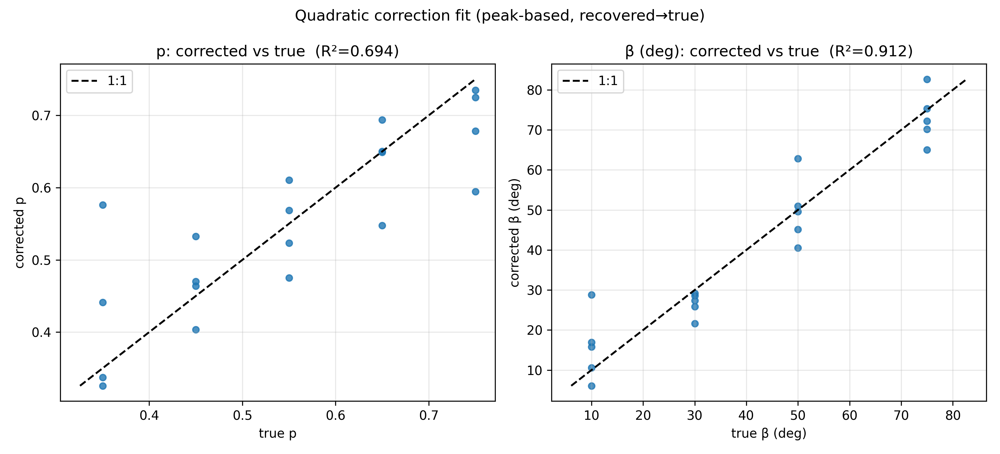
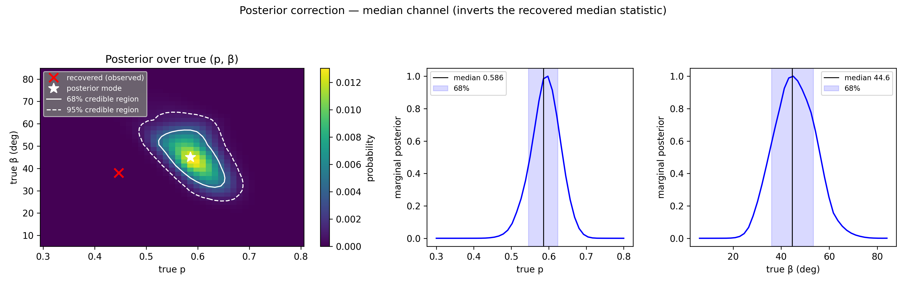
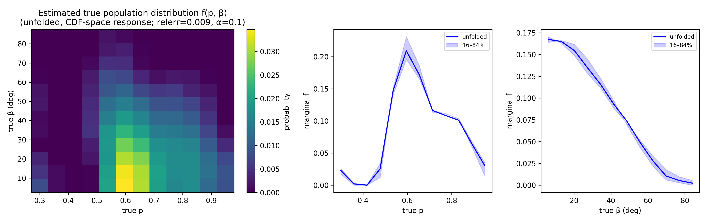

# PyLEADER

A Python version of the **LEADER** method (originally MATLAB; Nortunen & Kaasalainen 2017), with
enhancements for diagnostics, error determination, and per-population bias correction. PyLEADER
recovers the distributions of asteroid **shape elongation** (`p`) and **spin-axis latitude** (`β`)
for a whole population from WISE/NEOWISE thermal photometry.

Give it a **dynamical population ID** — a Nesvorný collisional family or a background main-belt
population — and the end-to-end driver queries NEOWISE, writes one `.obs` file per object, runs
LEADER, derives a correction function from *that population's own observing geometry*, and applies
it:

```sh
pyleader-population 1128            # a collisional family
pyleader-population BG_IB_Ctypes    # a background population (add --build to fetch photometry)
```

Every step is also available as a standalone command (see [Usage](#usage)).

## How it works

PyLEADER implements the **LEADER** method (*Latitudes and Elongations of Asteroid Distributions
Estimated Rapidly*) of Nortunen & Kaasalainen (2017). For large, sparsely sampled populations,
inverting individual lightcurves is infeasible — so instead of solving for one object at a time,
LEADER recovers the **joint distribution of shape elongation** `p` **and spin-axis latitude** `β` **for the
whole population** from the statistics of brightness variations. Each object is modeled as a triaxial
ellipsoid with axes `a ≥ b = c`; the shape elongation is `p = b/a ∈ (0, 1]` (`p = 1` is a sphere),
and `β` is the spin-axis latitude relative to the ecliptic.

**1. Per object — brightness amplitude.** For each apparition, from the phase-corrected intensities
`L` we compute the brightness-dispersion statistic and convert it to an amplitude `A`
(Eq. 7 of Nortunen & Kaasalainen 2017):

$$\eta = \frac{\Delta(L^2)}{\langle L^2\rangle}, \quad \Delta(L^2)=\sqrt{\big\langle (L^2-\langle L^2\rangle)^2\big\rangle}, \qquad A = \sqrt{1 - \dfrac{1}{\dfrac{1}{\sqrt{8}\eta} + \tfrac{1}{2}}}$$

In the code this is `eta = std(L**2)/mean(L**2)` and the `A` formula in
`[lightcurve.py](pyleader/lightcurve.py)`.

**2. Population — forward model.** Pooling `A` over all sampled objects gives the cumulative
distribution `C(A)`. LEADER writes it as a weighted sum of analytic basis functions `F_ij` over a
grid of `(p_i, β_j)` bins, a linear system in the **occupation numbers** `w_ij` (the unnormalized
joint distribution of `p` and `β`):

$$C(A) = \sum_{i,j} w_{ij} F_{ij}(A; p_i, \beta_j) \equiv M\mathbf{w}$$

The matrix `M` is assembled in `[inversion.py](pyleader/inversion.py)`.

**3. Population — regularized inversion.** The weights are recovered by non-negative least squares
with smoothness operators `R_p`, `R_β` that penalize sharp gradients in the `p` and `β` directions
(strengths `δ_p`, `δ_β`):

$$\min_{\mathbf{w}\ge0} \left\lVert \tilde{M}\mathbf{w} - \tilde{C} \right\rVert, \qquad \tilde{M} = \begin{bmatrix} M  \sqrt{\delta_p}R_p  \sqrt{\delta_\beta}R_\beta \end{bmatrix}$$

solved with SciPy's `lsq_linear` under the positivity bound `w ≥ 0`. The peak of `w` gives the
population's most likely `(p, β)`; repeating the experiment over many random draws of the sample
(the *trials*) yields the spread used for error determination.

**4. Bias correction (this package's main addition).** LEADER's recovered `(p, β)` is biased, and the
bias depends on the observing geometry — so it differs from dataset to dataset. PyLEADER therefore
derives a **per-population correction**: it builds synthetic populations of assigned `(p, β)` observed
at the *same population's* cadence/geometry, measures how LEADER recovers them, and fits a
recovered→true mapping to apply to the real result. This per-trial error determination and
correction machinery are the enhancements used in Sonnett, Lilly & Grav (2025).

## Install

```sh
pip install -e .            # editable install from a checkout
pip install -e ".[obs]"     # also install the .obs-building dependencies
```

This codebase requires Python version >= 3.9 and `numpy`/`scipy`/`matplotlib`; the `[obs]` extra adds
`astropy`/`sunpy`/`requests`, needed only for **building** `.obs` files (which also requires internet
access). Installing puts one console command per script on your `PATH`:


| command                    | script equivalent                       |
| -------------------------- | --------------------------------------- |
| `pyleader-population`      | `python scripts/run_population.py`      |
| `pyleader-download-models` | `python scripts/download_models.py`     |
| `pyleader-build-obs`       | `python scripts/build_obs_files.py`     |
| `pyleader-analysis`        | `python scripts/run_analysis.py`        |
| `pyleader-spot-check`      | `python scripts/spot_check.py`          |
| `pyleader-bias-map`        | `python scripts/bias_map.py`            |
| `pyleader-fit-correction`  | `python scripts/fit_correction.py`      |
| `pyleader-plot-bias-map`   | `python scripts/plot_bias_map.py`       |
| `pyleader-compare`         | `python scripts/compare_populations.py` |


The commands and `python scripts/<name>.py` forms are interchangeable; the examples below use the
installed commands.

## Usage

The pipeline flows in steps. `pyleader-population` runs steps **3–6** in one call (and step 2 with
`--build`); each step is also a standalone command.

```
   population ID  (family "1128"  or  background "BG_IB_Ctypes")
         │
   [1] pyleader-download-models      fetch DAMIT shape models        ── once, prerequisite
         │
   [2] pyleader-build-obs            query NEOWISE → one .obs/object  ── needs [obs] extras + internet
         │
   [3] pyleader-analysis             LEADER inversion → recovered (p, β) + spread
         │
   [4a] pyleader-bias-map            determine the bias map on THIS population's geometry
         │
   [5a] pyleader-fit-correction      fit recovered→true quadratic_correction.json
         │
   [6a] apply                        corrected (p, β) → population_report.txt

   [4b–6b] posterior correction + population distribution (same rank as 4a–6a; both run by default)

   └── pyleader-population wraps [3]–[6a] + [4b–5b] (and [2] with --build) ──┘
```


### Step 1 — Fetch DAMIT shape models

```sh
pyleader-download-models           # inside a virtual environment
python scripts/download_models.py  # outside a virtual environment
```

- **What it does:** 
downloads the representative DAMIT shape models the synthetic step needs. Run
once after cloning. The model *listing* (`asteroideja.txt`) ships with the package; the models
themselves (~29 MB) do not. Since this code connects to the DAMIT database (see References), runtime
is dependent on the internet connection strength, but on my local laptop with typical home internet
speeds, it took about 5 minutes to fully refresh all 347 models specified in this repo.  
- **Input:**
  - none (reads the shipped `asteroideja.txt`; queries the DAMIT database).
- **Arguments:**
  - `--refresh` re-download every listed model to its latest DAMIT version *(optional; default fetches only missing ones)*
  - `--damit-dir PATH` destination *(default* `damit_models/`*)*
- **Output:**
  - `<number>.txt` shape files in `damit_models/`


### Step 2 — Build `.obs` files

```sh
pyleader-build-obs                 # inside a virtual environment
python scripts/build_obs_files.py  # outside a virtual environment

# a collisional family (integer Nesvorný family ID):
pyleader-build-obs --famid 1128
# a background population (BG_<REGION>_<TYPE>types):
pyleader-build-obs --famid BG_IB_Ctypes --population background
```

- **What it does:** 
resolves the population to its member objects, queries NEOWISE @ IPAC for clean
photometry, and writes one `.obs` file per object (photometry + Sun/observer geometry per point).
- **Input:**
  - `AllMBAFamilyMembers.txt` (families) — the collisional-family membership list from the
    [Asteroid Families Portal](http://asteroids.matf.bg.ac.rs/fam/) (Radović et al. 2017;
    downloaded July 2025), concatenated with the newly identified family members of
    Nesvorný et al. (2024); see [References](#references). **Ships with the package**
    (gzipped, in `pyleader/data/`); a same-named copy in `--base-dir` takes precedence.
  - or `BGobjs_<REGION>_<TYPE>type_neowise.txt` (backgrounds) — background (non-family) object
    selections, already cross-matched with NEOWISE. **Ships with the package** likewise; see
    [Membership data: provenance & regeneration](#membership-data-provenance--regeneration).
  - plus `neowise_mainbelt.csv` — object diameters from the NEOWISE mission data release
    (Mainzer et al. 2019, [doi:10.26033/18S3-2Z54](https://doi.org/10.26033/18S3-2Z54)).
    **Not shipped** (~27 MB): download it from the PDS bundle at that DOI and place it in
    `--base-dir` (the code stops with these instructions if it is missing).
- **Arguments:**
  - `--famid ID` the integer Nesvorný family ID (e.g. `1128`), or a `BG_<REGION>_<TYPE>types` id for a background population (e.g. `BG_IB_Ctypes`) *(required)*
  - `--population {family,background}` type of population *(default* `family`*; set* `background` *for* `BG_*` *ids)*
  - `--cat CATALOG` IRSA catalog to query — one of `allsky_4band_p1bs_psd` *(default)*, `allsky_3band_p1bs_psd`, or `neowiser_p1bs_psd`
  - `--filterpriority {w2,w3}` which band's photometry to analyze *(default* `w3`*)*
  - `--min-obs N` minimum surviving detections to write an object's file *(int ≥ 1, default 5)*
  - `--istart N` object index to resume from after an interruption *(int ≥ 0, default 0)*
  - `--legacy-format` write the old block format *(optional; default tabular)*
  - `--base-dir PATH` the root working directory — membership/catalog files are read from it and
    the data/analysis directories are created beneath it. It is optional on every command; the
    default is the `DEFAULT_BASE_DIR` constant in `pyleader/config.py` (set for the author's
    machine), so on a new machine either pass `--base-dir` explicitly or edit that constant once.
  - `--obsdir DIR` write the `.obs` files to an exact directory instead of the derived path
- **Quality cuts:** for the analyzed band, a detection is kept only if its contamination-and-confusion flag `cc_flags` is clean (`0`, `p`, or `P`), its photometric quality `ph_qual` is `A`, `B`, or `C`, and its artifact flag is `0`; an object's file is written only if at least `--min-obs` detections survive.
- **Runtime:** roughly ~10 s per catalogued object at typical home-internet speeds (only objects with a NEOWISE/IPAC entry are fetched), limited by connection strength on both ends. A designated population can contain anywhere from ~100 to ~5000 objects, so this step can take many hours for heavily populated groups that NEOWISE also observed frequently.
- **Output:**
  - `<base-dir>/<Fam|>{id}_data_<cat>_<filter>/*.obs` (or `--obsdir` if given). The command prints
    the exact directory it wrote to when it finishes.


### Step 3 — Recover the distributions

```sh
pyleader-analysis               # inside a virtual environment
python scripts/run_analysis.py  # outside a virtual environment
```

- **What it does:** 
performs the **core LEADER analysis** — the regularized inversion of the pooled amplitude
statistics — over `ntrials` random draws of the population, writing the recovered `(p, β)`
distributions with their trial-to-trial spread. Note that this step produces the **raw** recovered
distributions only: it does not assess the systematic bias or model the uncertainties. The full
Steps 3–6a / 4b–6b chain is needed for bias-corrected results.
- **`ndraws` vs `ntrials`:** one *trial* = draw `ndraws` objects at random (with replacement) from
  the population's `.obs` files, pool their lightcurve amplitudes into a single CDF, and run one
  LEADER inversion on it. `ndraws` therefore sets the *statistical size of each sample*, while
  `ntrials` sets *how many times that whole experiment is repeated* (with independent random
  draws) — the scatter of the recovered peaks across trials is what provides the spread on the
  result. Total inversions = `ntrials`; total object draws = `ntrials × ndraws`.
- **Input:**
  - the population's `.obs` directory (from Step 2) + `neowise_mainbelt.csv` for diameters
    (NEOWISE mission data release, Mainzer et al. 2019 — see [References](#references)). The
    directory is derived as `<base-dir>/<Fam|>{id}_data_<cat>_<filter>/`; use `--obsdir DIR` to
    read from an exact directory that doesn't follow this naming.
- **Arguments:**
  - `--famid ID` the integer designation for the collisional family represented by the .obs files *(required)*
  - `--diam-low` / `--diam-high` diameter window in km *(≥ 0, low < high; default 3–5)*
  - `--ndraws N` objects randomly drawn from the .obs files per trial *(int ≥ 1, default 1000; see above)*
  - `--ntrials N` number of independent repeat experiments *(int ≥ 1, default 100; see above)*
  - `--phase-angle-limit DEG` max solar phase angle *(0–90, default 40)*
  - `--wanted N` min points per apparition *(int ≥ 3, default 5)*
  - `--date-tol DAYS` apparition gap *(> 0, default 60)*
  - `--population {family,background}`
  - `--obsdir DIR` read `.obs` from an exact directory
  - `--base-dir PATH` root working directory (see the note under Step 2)
  - `--forced-n` subsample each object to `wanted` amplitudes
  - `--overwrite`
  - `--seed N`
- **Runtime:** ~3 s per trial at the default `ndraws=1000` (Apple-silicon laptop; no network) —
  about **5–6 minutes** for the default 100 trials, scaling roughly linearly with
  `ntrials × ndraws`. If a run takes far longer than this, something is likely wrong (e.g. an
  unexpectedly empty or malformed `.obs` directory).
- **Progress & logging:** the terminal shows a single self-updating progress bar
  (`trial k/N (xx%)`); the full run record — configuration, per-trial results, and timestamps —
  is written to `analysis.log` inside the output directory.
- **Output:**
  - two sibling directories sharing the run's base name
    `<Fam|BG...><id>_<cat>_<filter>_<lo>km_to_<hi>km`:
    - `<base>_analysis/` — the per-`Trial*/` diagnostics
    - `<base>_summary/` — the headline products: `analysis.log` (the run's configuration header
      plus one row per trial: Pmax, Betamax, Relerr, N_obj, AvgPointsPerObj,
      N_apparitions_total — the `#` header lines make it directly readable with
      `np.genfromtxt`), the `Analysis_pmax/betamax_Famid<id>_*.png` peak histograms, and the
      across-trial marginal distributions (`Analysis_AllTrials_p_distribution`,
      `Analysis_AllTrials_b_distribution` `.png`/`.txt`). The command prints the output
      directory when it finishes.


### Step 4a — Determine the bias map

```sh
pyleader-bias-map                  # inside a virtual environment
python scripts/bias_map.py         # outside a virtual environment

# single grid point:
pyleader-spot-check                # inside a virtual environment
python scripts/spot_check.py       # outside a virtual environment
```

- **What it does:** 
builds synthetic populations with *assigned* `(p, β)` distributions from DAMIT shapes observed at
the target geometry, runs them through LEADER, and tabulates recovered-vs-assigned statistics
across a grid of assigned peaks.
- **Assigned-distribution scatter:** the synthetic objects are not all placed *exactly* at the
  assigned peaks; five `SyntheticConfig` fields (library API; not CLI flags) control the spread,
  with defaults taken directly from the original LEADER release (Nortunen & Kaasalainen 2017):
  `p_accept_tol = 0.075` (a stretched DAMIT shape is accepted when its `p` is within this of the
  peak), `p_escape_chance = 0.1` and `p_escape_min = 0.45` (a 10% chance to accept an off-peak
  shape anyway, provided `p` exceeds 0.45 — a broad tail), `beta_peak_chance = 0.75` (75% of
  objects draw `β` near the peak, the rest uniformly over 0–90°) and `beta_jitter = 0.05` rad
  (the Gaussian width around `β_peak`). The Step-4b fixed-peak preset overrides these to
  near-delta values (`0.02 / 0.0 / – / 1.0 / 0.01`).
- **Photometric noise:** by default (`--noise-model empirical`) the synthetic fluxes receive
  noise matched to the population's **own photometry**, built in two measured steps:

  1. **The error-bar relation.** A quadratic in log–log space,
     `log₁₀(σ_F/F) = c₀ + c₁·log₁₀(F) + c₂·log₁₀(F)²`, is fit once to every (flux, fluxerr)
     pair in the population's `.obs` files. It reproduces the familiar two-regime shape of
     survey photometry: at the faint end the absolute error is flat (set by the sky background
     and detector, independent of source brightness), while for bright sources the error grows
     in proportion to the flux (set by calibration). Each synthetic brightness is scaled to its
     borrowed object's mean measured flux and the relation is evaluated point by point, so
     fainter objects — and the fainter rotational phases of a single lightcurve — get
     proportionally larger errors.
  2. **The repeatability calibration.** A catalog error bar answers *"how far might this
     measurement be from the true flux?"* — it includes systematic terms (zero-point and other
     calibration uncertainties) that shift **all** of an object's measurements up or down
     *together*. But LEADER's amplitude statistic is differential: it only feels the
     **epoch-to-epoch scatter** — how much the measurements jitter relative to *each other* —
     and a shared calibration offset cancels out of it exactly. So the pipeline also measures,
     from the data themselves, what fraction of the quoted error bar shows up as genuine
     point-to-point scatter: in the *quietest* apparitions (near-spherical objects, pole-on
     viewing — negligible real lightcurve variation) the observed scatter divided by the quoted
     fluxerr directly reveals that fraction. This **repeatability fraction** (stored as
     `white_fraction`; the statistical term is "white noise" for random, uncorrelated
     scatter) multiplies the relation of step 1 before it is applied. For family 3556 it is
     0.32 — i.e. only about a third of the NEOWISE error bar behaves as epoch-to-epoch jitter.

  The fit, the fraction, and a diagnostic figure are recorded as `noise_model.json` +
  `noise_model_fit.png` so every simulation's noise is traceable to a measurement. Getting this
  right matters in both directions: the original release's flat 1% Gaussian (`--noise-model
  flat`) understates the real jitter for faint NEOWISE sources (which inflates apparent
  brightness variation and biases the recovery), while injecting the **full** catalog error bar
  as jitter overstates it several-fold — enough to push the recovered `p` of every synthetic
  population far below anything the real data produce.
- **`pyleader-bias-map` vs `pyleader-spot-check`:** the **bias map** runs one synthetic experiment per
  point of an assigned `(p_peak, β_peak)` **grid** (× `nseeds` realizations) and tabulates the
  results — its purpose is to *map the recovery bias across parameter space*, producing the table
  the Step-5a correction is fit from. **`pyleader-spot-check`** runs a **single** experiment at one
  assigned `(p, β)` and keeps that run's full diagnostics — its purpose is *inspection*: spot-check
  how well LEADER recovers one assigned distribution, debug scattering/geometry choices, or
  illustrate the method. The bias map calls the same single-run machinery internally.
- **Input:**
  - DAMIT models (`damit_models/`, from Step 1)
  - a geometry source: a directory of real `.obs` files whose observing cadence/geometry the
    synthetic objects are "observed" with (see `--geometry-dir` below; inside
    `pyleader-population` this is automatically the analyzed population's own files).
- **Arguments:**
  - `--p-peaks P …` assigned elongation peaks *(each* `0 < p ≤ 1`*; required for the bias map;
    pipeline default 0.35 0.45 0.55 0.65 0.75)*
  - `--b-peaks B …` assigned latitude peaks in **degrees** *(each* `0 < β < 90`*; required for the
    bias map; pipeline default 10 30 50 75; converted to radians internally)*
  - `--ndraws N` synthetic objects per grid point *(int ≥ 1, default 1000)*
  - `--nseeds N` realizations per grid point for error bars *(int ≥ 1, default 1)*
  - `--scattering {ls_lambert,hapke}` *(default* `ls_lambert`*, matching the MATLAB code)*
  - `--geometry-dir PATH` directory of real `.obs` files supplying the observing geometry
    *(default: the WISE 3-band subset shipped with the original LEADER release — a path constant
    in* `pyleader/synthetic/config.py` *set for the author's machine; pass it explicitly on other
    machines, or let* `pyleader-population` *use the population's own files)*
  - `--outdir PATH` *(required for the bias map; for* `pyleader-spot-check` *it defaults to*
    `<base-dir>/synthetic_validation_p<P>_b<B>deg`*)*
  - `--noise-model {empirical,flat}` photometric noise for the synthetic fluxes *(default*
    `empirical`*, fit from the geometry files — see above)*
  - `--seed N`
- **Output:**
  - `bias_map_stats.csv` (one row per grid point × seed: min/max/mean/median of assigned vs. recovered
    `p`, `β`). CSV rather than plain text because it is the machine-readable input to Step 5a, read
    by column name; it also opens directly in Excel/pandas.
  - `bias_map_summary.png` — `pyleader-plot-bias-map <csv>` re-renders the summary
  - per-grid-point subdirectories named `trial<i>_p<P>_b<B>deg/` with the single-run diagnostics


### Step 5a — Fit the correction

```sh
pyleader-fit-correction           # inside a virtual environment
python scripts/fit_correction.py  # outside a virtual environment
```

- **What it does:** 
fits the recovered→true mapping (a 2-D quadratic in recovered `p`, `β`) from a
bias-map CSV — the correction to apply to real LEADER output.
- **Input:**
  - a `bias_map_stats.csv` from Step 4a
- **Arguments:**
  - `csv` path *(required)*
  - `--stat {peak,mean,median}` which statistic to correct *(default* `mean`*; the pipeline uses* `peak`*, matching LEADER's reported pmax/betamax)*
  - `-o PATH` output JSON
- **Output:**
  - `quadratic_correction.json` (coefficients + fit diagnostics) and a predicted-vs-true `quadratic_correction_fit.png`
- **Equation form:** the fitted correction is a pair of degree-2 polynomial surfaces in the
  recovered values (`p` ≡ recovered `p`, `β` ≡ recovered `β` in degrees):

$$p_{\rm corr} = c_0 + c_1 p + c_2 \beta + c_3 p^2 + c_4\, p\beta + c_5 \beta^2$$

$$\beta_{\rm corr} = d_0 + d_1 p + d_2 \beta + d_3 p^2 + d_4\, p\beta + d_5 \beta^2$$

  The twelve coefficients are fit by least squares to the bias-map points (each run's recovered
  statistic vs. its assigned peak) and stored in `quadratic_correction.json`; results are clipped
  to the physical ranges `p ∈ [0, 1]`, `β ∈ [0°, 90°]`. With too few points for 6 terms the fit
  automatically drops to linear (3) or constant (1).


### Step 6a — Apply the correction

Apply a fitted (or the shipped default) correction to real LEADER output:

```python
from pyleader.synthetic import default_correction, load_correction, apply_correction

corr = default_correction()                              # shipped with the package
# corr = load_correction("quadratic_correction.json")    # or a population-specific fit
p_true, beta_true = apply_correction(p_recovered, beta_recovered_deg, corr)
```

`pyleader-compare A.npz B.npz --outdir cmp` (in a virtual environment) — or
`python scripts/compare_populations.py A.npz B.npz --outdir cmp` (outside one) — reports the
L1/L2/L∞ distances between two recovered distributions.

### Steps 4b–6b — Probabilistic correction (credible intervals) & unfolding

The quadratic correction of Steps 4a–6a maps a recovered peak to a **single** corrected value — but
the p–β degeneracy (e.g. a sphere at β=0 vs. an elongated object seen pole-on) makes the
recovered→true mapping many-to-one, and the quadratic silently picks one answer. The probabilistic
path replaces it with a Bayesian inversion of a sampled forward model.

The two corrections are **fundamentally different and independent**: the quadratic is a
deterministic least-squares surface fit to the bias-map means (Steps 4a–5a), while the posterior
inverts a separately simulated fixed-peak forward model (Steps 4b–5b) — different simulations,
different mathematics, no shared fitted parameters. That independence is exactly why the pipeline
runs **both by default** (`--correction-method both`): when two unrelated estimators land on
compatible answers, confidence in the result rises; when they disagree, something specific is
being flagged — usually the quadratic extrapolating outside its fitted range, or the degeneracy
making a single-valued correction inadequate (a multimodal posterior). The posterior's credible
intervals are the primary uncertainty statement; the quadratic serves as its fast, independent
cross-check.

**Step 4b — Build the fixed-peak basis** (`pyleader-basis` / `python scripts/basis_runs.py`):

```sh
pyleader-basis 1128 --diam-low 1 --diam-high 100      # 12×12 grid × 4 seeds (defaults)
```

- **What it does:** runs fixed-peak synthetic populations (every object at one assigned
  `(p, β)` — a near-delta distribution, in statistical terms)
  on a grid of assigned values, at the population's own geometry — the sampled forward model.
  **Resumable** (completed points are skipped) and **parallel** (8 workers by default, capped at
  cores − 2); a chunk flag `--task k/N` supports cluster job arrays.
- **Input:**
  - DAMIT models (`damit_models/`, from Step 1)
  - the population's `.obs` files (resolved from the population ID + diameter cuts, or an
    explicit `--geometry-dir`)
- **Arguments:**
  - the positional population `ID` *(required; a label when using* `--geometry-dir`*)*
  - `--grid-np N` / `--grid-nb N` grid size *(default 12×12; also sets the resolution of the
    posterior and of the Step-6b population distribution)*
  - `--p-range LO HI` assigned `p` range *(default 0.30 0.95 — wide enough that real recoveries
    cannot pin against the upper edge)*
  - `--b-range LO HI` assigned `β` range in **degrees** *(default 6 84)*
  - `--nseeds N` realizations per grid point *(default 4; see Runtime below)*
  - `--ndraws N` synthetic objects per run *(default 1000)*
  - `--noise-model {empirical,flat}` photometric noise *(default* `empirical`*; the fit is
    recorded in the basis directory)*
  - `--nproc N` worker processes *(default: 8, capped at cores − 2)*
  - `--task k/N` run only the k-th of N chunks *(for job arrays)*
  - `--outdir PATH` *(default* `<analysis outdir>_basis`*)*
  - plus the Step-3 population/tolerance options (`--diam-low/-high`, `--phase-angle-limit`,
    `--date-tol`, `--wanted`, `--population`, `--obsdir`, `--base-dir`)
- **Consistency:** a basis must be built under **one** noise model throughout — mixing units is
  invalid, so `pyleader-basis` warns when resuming a directory whose existing units used a
  different one (bases predating the empirical model count as flat). Rebuild in a fresh
  `--outdir` after changing the noise model.
- **Output:**
  - one `gp_p*_b*_seed*/synthetic_result.npz` per unit
  - `basis_info.json` (grid, seeds, tolerances, and the noise model used)
  - `noise_model.json` + `noise_model_fit.png` (when fit from the geometry files)
- **Runtime & how many seeds:** wall time ≈ units × (time per unit) ÷ workers, and is exactly
  linear in grid points × `--nseeds`. A unit costs ≈ 33 s single-core (measured on family 3556,
  5–10 km, M3 Max), dominated by the fixed-peak shape sampling (the tight ±0.02 tolerance
  accepts only ~1 in 14 stretched DAMIT shapes; the parsed models are cached in memory per
  worker). The default 12×12 grid × 4 seeds (576 units) is therefore **~40 min** on 8 workers,
  and × 8 seeds ≈ 80 min (measured: 1152 units in 78 min). The seeds measure
  the *scatter* of the recovery,
  and the scatter estimate improves as $1/\sqrt{2(n_{\rm seeds}-1)}$: **4 seeds** → known to ~±40%
  (fine for exploration), **8–10** → ~±25% (recommended for publication-grade credible intervals),
  **16+** → diminishing returns. Because the basis is **resumable**, you can start at 4 seeds and
  later re-run with `--nseeds 8` (or `--basis-nseeds 8` in the pipeline): only the *new* units are
  computed, and re-running the posterior afterwards re-determines the credible intervals with the
  improved scatter estimate.

**Step 5b — Posterior correction** (inside `pyleader-population`; default `--correction-method both`):
a recovered summary statistic is inverted through the basis with Bayes' rule, yielding a
**posterior over the true `(p, β)` peak** — median, 68%/95% credible intervals, the mode
(the single most probable value; the statistical term is MAP), and a
**multimodality flag** where the degeneracy admits several answers.

**How Bayes' rule enters.** The basis answers the *forward* question by brute force: "if the truth
were `(p, β)`, what would LEADER recover?" — at each assigned grid point the `nseeds` realizations
give the mean and scatter of the recovered statistic, i.e. an empirical likelihood
`P(recovered | truth)` (modeled as a Gaussian with that mean and covariance). Bayes' rule turns
this around into the question actually being asked:

$$P(\mathrm{truth} \mid \mathrm{recovered}) \;\propto\; P(\mathrm{recovered} \mid \mathrm{truth}) \times P(\mathrm{truth})$$

With a flat (uninformative) prior `P(truth)` over the basis grid, the posterior at each candidate
truth is simply the Gaussian likelihood of the *one observed* recovery evaluated against that grid
point's forward mean/covariance, normalized over the grid. No fitting is involved — the basis
**is** the model.

**Reading the 2-D posterior map.** A **diagonal ridge** (or a tilted, elongated credible region)
in the `(p, β)` probability heatmap is *expected* and is not a numerical problem: it is the
p–β degeneracy made visible. Different `(p, β)` combinations produce nearly identical amplitude
statistics (a rounder shape at low `β` mimics an elongated one seen pole-on), so a whole diagonal
family of truths is consistent with one recovery, and the posterior honestly assigns them all
probability. When the ridge breaks into disjoint islands, the multimodality flag fires.

- **Input:**
  - the Step-3 analysis (its per-trial joint solutions) + the Step-4b basis
    (auto-built and auto-resumed if absent)
- **Arguments** (as `pyleader-population` flags; Step 5b runs inside the pipeline):
  - `--posterior-stat {peak,median,both}` which recovered statistic is inverted *(default*
    `both`*)*: the recovered **peak** (marginal argmax) or the recovered **median** (weighted
    median of the marginals — a continuous, less bin-quantized observable). Running both
    doubles as a **consistency check**, reported in `population_report.txt`: for a genuinely
    single-peaked population the two channels must agree (overlapping 68% intervals);
    disagreement flags a skewed or multimodal population.
  - `--basis-dir PATH` / `--basis-nseeds N` / `--basis-nproc N` control the underlying basis
    (see Step 4b and "The whole pipeline")
- **Output:**
  - `<base>_summary/posterior_correction_{peak,median}.png` (one figure per channel)
  - `<base>_summary/posterior_{peak,median}.npz` (the posterior density + statistics)
  - per-channel blocks and the peak-vs-median consistency line in
    `<base>_summary/population_report.txt`
- **Assumption:** the posterior is calibrated on fixed-peak populations, so its meaning is
  conditional on the underlying population being approximately **single-peaked**. For strongly
  skewed or multimodal populations 'the peak' itself is ill-defined — the multimodality flag and
  the peak-vs-median consistency check are the built-in alarms, and the Step-6b population
  distribution is the product that can actually reveal such structure.

**Step 6b — Unfold the full distribution** (`pyleader-unfold` / `python scripts/unfold_analysis.py`):

```sh
pyleader-unfold <analysis_outdir> --basis <analysis_outdir>_basis
```

- **What it does:** treats the basis as a **response matrix** and inverts the real analysis into
  an estimate of the *true* `f(p, β)` on the basis grid, with 16–84% bands from a perturbation
  ensemble. **This product is computed independently of the posterior correction** — both are
  built from the same basis, but neither uses the other's results: the posterior locates the
  population's *peak*; this estimates the population's full *spread across objects*.
- **Two response spaces** (`--space {cdf,w}`):
  - **`cdf` (default, recommended for evaluating systematics):** the response columns are each
    basis point's simulated **amplitude CDF**, and the observation is the population's pooled
    amplitude CDF. Pooling amplitudes *is* mixing, so the forward model is **exactly linear in
    mixtures** — the residual misfit is measurement + sampling noise only, with no inversion
    model error. Requires a basis whose units saved their amplitude samples (built from
    2026-07-08 on).
  - **`w`:** the original response over recovered joint solutions; works with any
    basis/analysis. *Caveat:* it assumes the recovered solution of a mixture is the mixture of
    recovered solutions, which the regularized inversion violates mildly (measured with the
    built-in mixture validation) — treat W-space shapes as indicative and check the printed
    `relerr`.
- **Input:**
  - the Step-3 analysis directory (its `Trial*/W_trial*.npz`; for `--space cdf`, the saved
    per-trial amplitudes or the raw `.obs` files via `--obsdir`)
  - a completed Step-4b basis
- **Arguments:**
  - the positional `analysis_outdir` *(required)*
  - `--basis PATH` *(default* `<analysis_outdir>_basis`*)*
  - `--space {cdf,w}` response space *(default* `cdf`*; see above)*
  - `--obsdir DIR` recompute the observed amplitude CDF directly from these `.obs` files
    *(for* `cdf` *with analyses that predate per-trial amplitude saving)*
  - `--wanted N` / `--date-tol DAYS` / `--phase-angle-limit DEG` cuts used with `--obsdir`
    *(defaults 5 / 60 / 40 — match the analysis)*
  - `--n-ensemble N` perturbation re-solves for the error bands *(default 40)*
  - `--seed N`
- **Output:**
  - `<base>_summary/population_distribution.npz` + `.png` (joint map + marginals with 16–84% bands)

### The whole pipeline

```sh
pyleader-population               # inside a virtual environment
python scripts/run_population.py  # outside a virtual environment
```

Runs the whole chain — steps 3–6a plus the probabilistic 4b–5b — for one population, deriving the correction from **that population's own** `.obs`
**observing geometry** (the scientifically appropriate choice, since the geometry — hence the bias —
differs per dataset):

```sh
# a collisional family, analyzing an existing .obs dataset end-to-end
pyleader-population 1128 --diam-low 1 --diam-high 100

# a background population, fetching .obs from NEOWISE first
pyleader-population BG_IB_Ctypes --build
```

- **Input:**
  - the population's `.obs` directory (or `--build` to create it) + DAMIT models (`pyleader-download-models`; the run stops early with instructions if they are missing).
- **Arguments:**
  - the positional population `ID` *(required)*
  - the Step-3 analysis options (`--diam-low/-high`, `--ntrials`, `--ndraws`, `--phase-angle-limit`, `--date-tol`, `--wanted`)
  - the Step-4a bias-map options (`--p-peaks`, `--b-peaks`, `--bias-map-ndraws`, `--bias-map-nseeds`, `--scattering`)
  - `--noise-model {empirical,flat}` synthetic photometric noise *(default* `empirical`*: the
    population's own flux–fluxerr relation, calibrated to the measured epoch-to-epoch
    repeatability and applied point by point; see Step 4a)*
  - `--correction-stat {peak,mean,median}` *(default* `peak`*)*
  - `--correction-method {quadratic,posterior,both}` which correction(s) to derive *(default*
    `both`*; posterior auto-builds/resumes the Step-4b fixed-peak basis)*
  - `--posterior-stat {peak,median,both}` which recovered statistic the posterior inverts
    *(default* `both`*, which also reports the peak-vs-median consistency check)*
  - `--basis-dir PATH` *(default* `<analysis outdir>_basis`*)*; `--basis-grid NP NB` *(default
    12 12)*; `--basis-p-range LO HI` *(default 0.30 0.95)*; `--basis-b-range LO HI` degrees
    *(default 6 84)*; `--basis-nseeds N` *(default 4)*; `--basis-nproc N` parallel workers
    *(default: 8, capped at cores − 2)*
  - `--build`
  - `--refresh-models` re-download the latest DAMIT models first
  - `--base-dir PATH`
  - `--obsdir DIR` read/write `.obs` from an exact directory (the bias map's geometry follows it)
  - `--seed N`
- **Runtime** (measured: family 3556, 5–10 km cut, 362 objects, M3 Max, 8 basis workers): the
  LEADER analysis takes ~5 min (100 trials × 1000 draws), the bias map ~3 min (20 runs), and the
  fixed-peak basis dominates — ~40 min at the default 12×12 × 4 seeds, ~78 min at 8 seeds. The
  corrections, posteriors, and report add seconds. **End-to-end: ~50–90 min** depending on
  `--basis-nseeds`; everything scales linearly with trials, draws, and basis units.
- **Output:** four sibling directories sharing one base name (they sort together in the
  working dir; re-running the analysis rebuilds the first two and never touches the expensive,
  reusable simulation libraries):
  - **`<base>_summary/`** — every headline product in one place: `population_report.txt`,
    `analysis.log` (configuration + the per-trial results table), the
    `Analysis_pmax/betamax_*.png` peak histograms,
    `Analysis_AllTrials_{p,b}_distribution.png`/`.txt`, the fitted noise model
    (`noise_model.json` + `noise_model_fit.png`), the quadratic correction
    (`quadratic_correction.json` + `quadratic_correction_fit.png` + `bias_map_summary.png`), the
    posterior products (`posterior_correction_{peak,median}.png` + npz), and — after
    `pyleader-unfold` — `population_distribution.png`/`.npz`.
  - `<base>_analysis/` — the per-`Trial*/` diagnostics
  - `<base>_biasmap/` and `<base>_basis/` — the simulation libraries


### `.obs` file format

PyLEADER reads **either** layout — `read_obs()` auto-detects them, so datasets from prior analyses
work unchanged. **Both are fully supported.**

- **Tabular** (written by default): a `#` comment header, then one whitespace-delimited row per
measurement — `jd  sun_x sun_y sun_z  obs_x obs_y obs_z  wavelength flux fluxerr filter`.
- **Legacy block:** the original format (count header; per-epoch Sun/observer vectors and
`λ flux σ filter` lines separated by blank lines). Pass `--legacy-format` to write it.


### Membership data: provenance & regeneration

The population membership files **ship with the package** (gzipped under `pyleader/data/`; numpy
reads them directly). A same-named uncompressed copy in `--base-dir` always takes precedence, so
you can substitute updated versions without touching the package. To regenerate them from the
original sources:

**`AllMBAFamilyMembers.txt`** — three whitespace-delimited columns:
`family_id  packed_MPC_designation  object_number/designation`.

1. Download the complete family-member list from the
   [Asteroid Families Portal](http://asteroids.matf.bg.ac.rs/fam/) (Radović et al. 2017) —
   the shipped copy was downloaded July 2025 (portal list last updated April 2023).
2. Append the member lists of the 136 newly identified families of Nesvorný et al. (2024),
   converted to the same three-column format.

**`BGobjs_<REGION>_<TYPE>type_neowise.txt`** — five columns:
`object_number  provisional_designation  packed_MPC_name  diameter_km  diameter_uncertainty_km`
(the matching NEOWISE catalog row). The eight shipped files cover four main-belt regions × two
taxonomic complexes. Regeneration recipe:

1. Start from a proper-elements catalog (the shipped selections used the Nesvorný et al. 2024
   catalog of proper orbits).
2. Split by proper semimajor axis into regions bounded by the Kirkwood gaps:
   **IB** (inner) 2.060–2.502 au, **MB** (middle) 2.502–2.825 au, **PB** (pristine)
   2.825–2.955 au, **OB** (outer) 2.955–3.279 au.
3. Remove every object that appears in the family membership list above — the remainder is the
   *background* population of each region.
4. Cross-match each region's background list with the NEOWISE diameters table
   (Mainzer et al. 2019), keeping the columns listed above.
5. Split each region into **C**- and **S**-complex subsets using literature taxonomic
   classifications (the shipped files used a compilation with per-object source tags, e.g. the
   DES *griz*-based classifications of Carruba et al. 2024).

**`neowise_mainbelt.csv`** is deliberately **not** shipped (~27 MB): download it from the NEOWISE
Diameters and Albedos V2.0 bundle (Mainzer et al. 2019,
[doi:10.26033/18S3-2Z54](https://doi.org/10.26033/18S3-2Z54)) at the NASA PDS Small Bodies Node
and place it in `--base-dir`. Steps 2–3 stop early with these instructions if it is missing.

### As a library

```python
from pyleader import PopulationConfig, run_population

if __name__ == "__main__":   # required: the parallel basis uses multiprocessing 'spawn'
    result = run_population(PopulationConfig(pop_id="1128", diam_low=1, diam_high=100), seed=0)
    print(result.recovered, "->", result.corrected)        # quadratic correction
    print(result.posterior.p_median, result.posterior.b_median)  # posterior (median channel)
```

Saved figures can be **re-rendered without re-running anything** — the `.npz` products carry
everything the plots need, so publication tweaks (titles, labels, fonts) never cost a
simulation:

```python
from pyleader.synthetic.posterior import Posterior, plot_posterior
from pyleader.synthetic.unfold import UnfoldResult, plot_unfolded

post = Posterior.load("<base>_summary/posterior_median.npz")
plot_posterior(post, "posterior_for_paper.png", stat="median")

dist = UnfoldResult.load("<base>_summary/population_distribution.npz")
plot_unfolded(dist, "distribution_for_paper.png", space="CDF")
```

The plot functions are short matplotlib wrappers ([posterior.py](pyleader/synthetic/posterior.py),
[unfold.py](pyleader/synthetic/unfold.py)) — for full control of titles and axis labels, copy one
into your own script and edit it, passing the loaded object in.

> **Note:** wrap library calls that reach the parallel basis (`run_population` with the posterior
> enabled, or `run_basis`) in the `if __name__ == "__main__":` guard — Python's `spawn`
> multiprocessing re-imports your script in each worker, and without the guard your script's
> top-level code re-executes per worker. PyLEADER detects the unguarded/interactive cases and
> falls back to serial execution with a note, but the guard is what gets you parallelism.


## Worked example: the 3556 (Lixiaohua) family

Everything below is **one run** on a single dataset — the 5–10 km members of family 3556
(362 objects), analyzed end-to-end with the package defaults (100 trials × 1000 draws;
12×12 basis × 8 seeds over `p ∈ [0.30, 0.95]`; empirical photometric noise calibrated to the
measured epoch-to-epoch repeatability):

```sh
pyleader-population 3556 --diam-low 5 --diam-high 10 --basis-nseeds 8
pyleader-unfold <base>_analysis      # after the pipeline; <base> is printed when it finishes
```

(Wall time for this run: ~87 min — ~5 min analysis, ~3 min bias map, ~78 min basis.)

**Step 3 — per-trial diagnostics.** The inversion fits the cumulative distribution of light-curve
amplitudes `A`; the relative error measures how well the reconstructed CDF (∑ wᵢⱼFᵢⱼ) matches the
observed one. The solved occupation numbers `w` over the `(p, β)` grid, and the smoothed joint
distribution:





**Step 3 — across all trials.** The peak of the shape (`p`) and spin-axis (`β`) distributions
over the 100 trials, each with a Gaussian fit giving the raw (uncorrected) population value and
its trial-to-trial spread:




**Steps 4a–6a — bias map and quadratic correction.** The bias map observes synthetic populations
of assigned `(p_peak, β_peak)` (20 grid points) at this family's *own* cadence, geometry, and
noise. The summary shows how LEADER's recovered means (colored) depart from the assigned truth
(dashed) — making the direction of the bias and the `p`–`β` interdependence explicit:



`p` is recovered biased low everywhere, and by *more* at low spin latitude (the `β_peak = 10°`
curve sits farthest below the diagonal) — photometric noise inflates the apparent brightness
variation, and low-latitude geometries compound it. `β` is compressed toward mid-range
(over-estimated below ~45°, under-estimated above), nearly independently of `p_peak`. Fitting the
recovered→true quadratic to these points gives the Step-5a correction (R²: 0.69 in `p`, 0.91 in
`β`):



Applying it de-biases the LEADER result (`population_report.txt`):


| quantity  | recovered | quadratic-corrected |
| --------- | --------- | ------------------- |
| `p`       | 0.492     | **0.618**           |
| `β` (deg) | 38.5      | **31.5**            |


**Step 5b — posterior correction.** The probabilistic path answers the same question with
credible intervals. Below is the median-channel posterior from the same run:



A possible interpretation, element by element:

- The red **×** is what LEADER actually recovered (here the recovered *median* statistic,
  `p = 0.46`, `β = 40°`). The colored surface answers: *given that recovery, where is the
  population's true peak likely to be?* The offset between the × and the probability mass **is**
  the bias — for this family, LEADER under-reports `p` by ~0.13 and under-reports `β` by ~7°.
- The credible contours are compact and **single-peaked**, so this dataset supports a definite
  statement: *the family's true peak lies at `p = 0.58 ± 0.03`, `β = 47° ± 6°` (68%)* — the
  family is moderately elongated with mid-latitude spins. Had the region been a long diagonal
  ridge or several islands (see the multimodality note in Step 5b), the honest statement would
  instead be "several true populations are consistent with this recovery".
- The **tilt** of the credible ellipse shows the residual p–β degeneracy: slightly rounder shapes
  with slightly lower spin latitudes mimic slightly more elongated shapes at higher latitudes.
  The marginals (middle/right panels) integrate over that tilt, which is why quoting the two
  1-D intervals separately is slightly conservative.
- What these products can — and cannot — reveal: the posterior constrains the **peak** of the
  population's `(p, β)` distribution, not its shape or width. The population's *spread* is the
  job of the Step-6b population distribution, and the per-channel consistency check in
  `population_report.txt` (peak vs median channel) guards the single-peak assumption behind
  this figure.

Note the cross-check the two independent corrections provide: they agree well on `p`
(quadratic 0.618 vs posterior 0.58 ± 0.03) but differ on `β` (31.5° vs 47° ± 6°) — `β` is the
noise-sensitive coordinate, the quadratic is a point estimate fit to 20 bias-map runs, and when
the two paths disagree the posterior's credible interval is the primary statement (see
Steps 4a–6a vs 4b–6b above).

**Step 6b — population distribution (same run).** `pyleader-unfold` on the same analysis and basis gives
the complementary product — the estimated spread of the whole population, not just its peak:



Reading it: the `p` marginal (middle) is well constrained — the population's elongations
concentrate around `p ≈ 0.6` with a tail toward rounder shapes, and the population *median*
object sits at `p ≈ 0.63` (the narrow 16–84% bands are statistical only). Note the consistency
with — and independence from — the posterior above: the peak of the *distribution* and the
posterior's *peak location* land in the same place by two unrelated computations. The `β`
marginal (right) should be read with more caution: the mixture validation shows that `β`
structure in the *unfolded* product remains degeneracy-limited at NEOWISE noise levels, so its
monotonic decline toward high latitudes is indicative, not definitive — for a defensible `β`
statement, quote the posterior's credible interval instead.

## Package layout

```
pyleader/
  pipeline.py      run_population(): the end-to-end per-population driver
  populations.py   resolve a family / background ID to its member objects
  config.py        AnalysisConfig / ObsBuildConfig / (SyntheticConfig, PopulationConfig)
  obsio.py         read/write .obs files (auto-detects tabular or legacy block format)
  lightcurve.py    read & phase-correct .obs -> amplitudes  (lcg_read_WISE)
  inversion.py     linear inversion for (p, β) occupation numbers  (leader_invert)
  postprocess.py   solution smoothing;  plotting.py  per-trial & summary plots
  analysis.py      run_analysis(): the LEADER experiment driver
  obsfiles/        build .obs files from IRSA + JPL Horizons
  synthetic/       synthetic validation, bias mapping, and correction (from DAMIT models)
  cli/             console-command implementations (scripts/*.py are thin shims)
```


## Notes on the notebook → package conversion

The package supersedes the original Jupyter notebooks (`LEADER_python_final`, `_bg`, `_forcedN`),
which are unified into one configurable driver (`_bg` = `--population background`, `_forcedN` =
`--forced-n`). A few clear bugs were fixed during conversion (each marked `# FIX:` in the source:
phase-correction return value, an apparition off-by-one, the forced-N subsampling, and removal of
dead `interp2d`/`mlab` imports), so results are not bit-for-bit identical to the notebooks.

## References

- Nortunen, H., & Kaasalainen, M. 2017, *LEADER: fast estimates of asteroid shape elongation
and spin latitude distributions from scarce photometry*, Astronomy & Astrophysics, 608, A91.
[doi:10.1051/0004-6361/201731360](https://doi.org/10.1051/0004-6361/201731360)
- Sonnett, S., Lilly, E., & Grav, T. 2025, *Exploring Dynamical and Evolutionary Processes via
Debiased Main Belt Asteroid Size-Frequency Distributions*, EPSC-DPS Joint Meeting 2025,
EPSC-DPS2025-2069. [doi:10.5194/epsc-dps2025-2069](https://doi.org/10.5194/epsc-dps2025-2069)
- Ďurech, J., Sidorin, V., & Kaasalainen, M. 2010, *DAMIT: a database of asteroid models*,
Astronomy & Astrophysics, 513, A46. [doi:10.1051/0004-6361/200912693](https://doi.org/10.1051/0004-6361/200912693)
— source of the shape models used by the synthetic-validation pipeline
([DAMIT database](https://damit.cuni.cz/)).
- Mainzer, A. K., Bauer, J. M., Cutri, R. M., Grav, T., Kramer, E. A., Masiero, J. R.,
Sonnett, S., & Wright, E. L. (Eds.) 2019, *NEOWISE Diameters and Albedos V2.0*,
NASA Planetary Data System. [doi:10.26033/18S3-2Z54](https://doi.org/10.26033/18S3-2Z54)
— source of the object diameters (`neowise_mainbelt.csv`) used for the sample selection in
Steps 2–3.
- Radović, V., Novaković, B., Carruba, V., & Marčeta, D. 2017, *An automatic approach to exclude
interlopers from asteroid families*, Monthly Notices of the Royal Astronomical Society, 471, 1215.
[doi:10.1093/mnras/stx1273](https://doi.org/10.1093/mnras/stx1273)
— the [Asteroid Families Portal](http://asteroids.matf.bg.ac.rs/fam/), source of the collisional
family membership list (`AllMBAFamilyMembers.txt`).
- Nesvorný, D., Roig, F., Vokrouhlický, D., & Brož, M. 2024, *Catalog of Proper Orbits for
1.25 Million Main-belt Asteroids and Discovery of 136 New Collisional Families*, Astrophysical
Journal Supplement Series, 274, 25. [doi:10.3847/1538-4365/ad675c](https://doi.org/10.3847/1538-4365/ad675c)
— source of the newly identified family members concatenated into the membership list, and of the
proper elements used for the background-region selections.
- Carruba, V., et al. 2024, *Main belt asteroids taxonomical information from dark energy survey
data*, [Monthly Notices of the Royal Astronomical Society, 527, 6495](https://academic.oup.com/mnras/article/527/3/6495/7395022)
— among the taxonomic classifications used to split the background selections into C- and
S-complexes.

