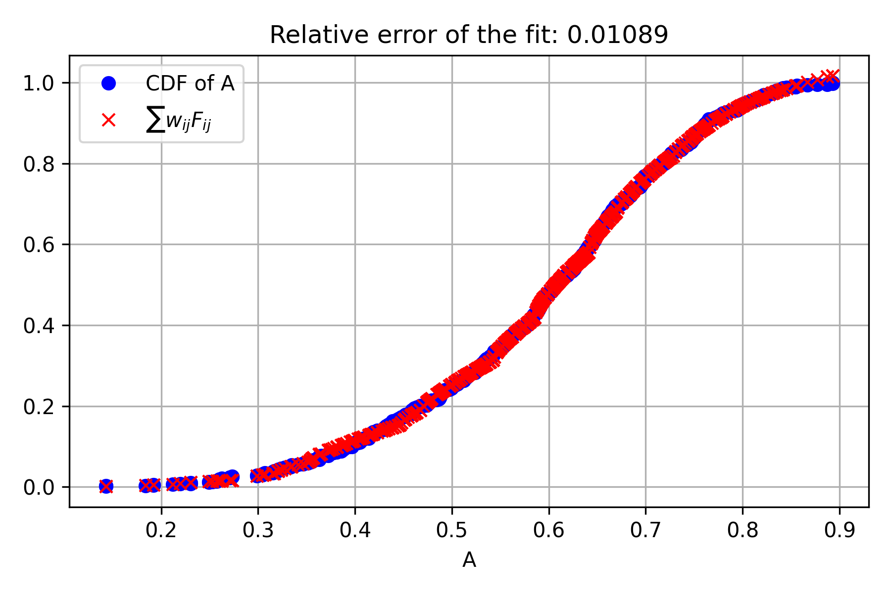
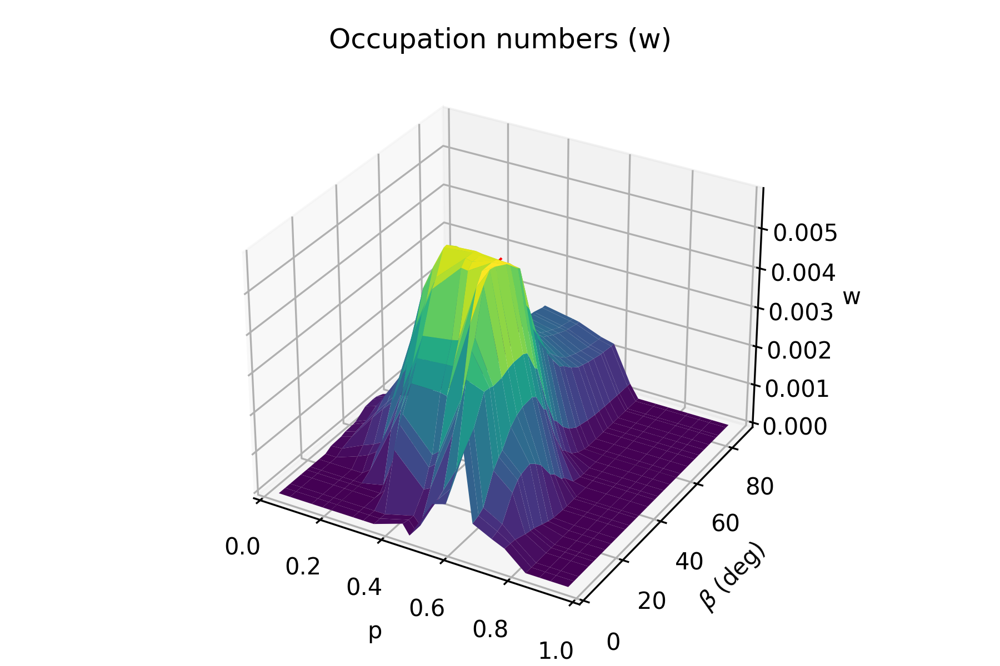
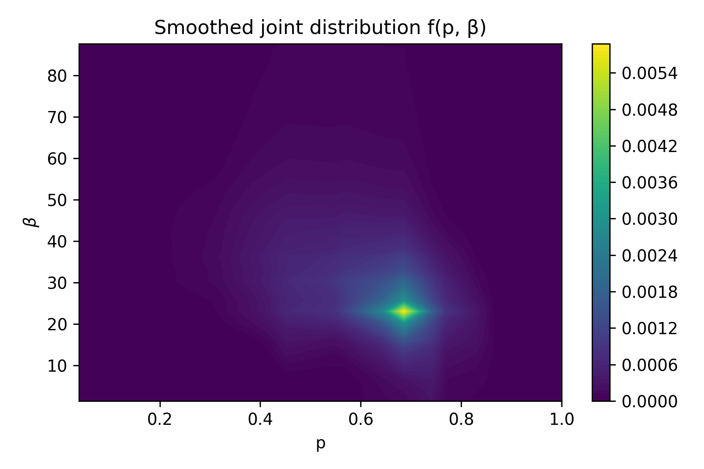
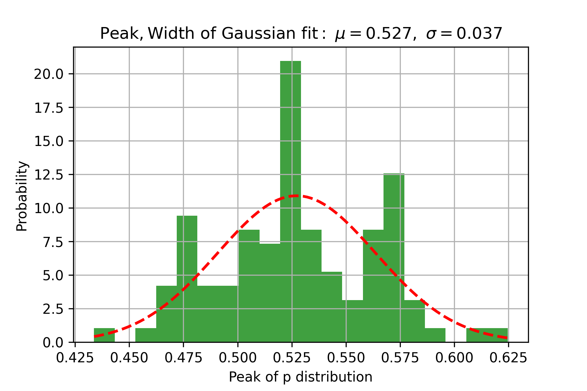
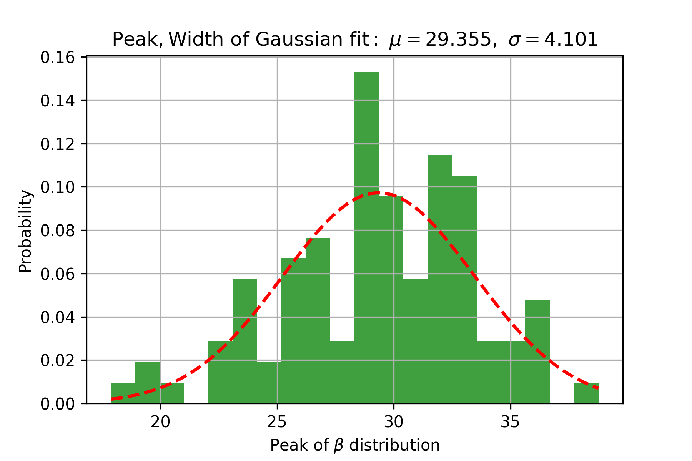

# PyLEADER

A Python version of the LEADER package (originally written in MATLAB; Nortunen & Kaasalainen 2017),
with a few enhancements for diagnostics and error determination. PyLEADER derives the
distributions of asteroid shape elongation (`p`) and spin-axis latitude (`beta`) for a
population from WISE/NEOWISE thermal photometry.

## How it works

PyLEADER implements the **LEADER** method (*Latitudes and Elongations of Asteroid
Distributions Estimated Rapidly*) of Nortunen & Kaasalainen (2017). For large, sparsely
sampled populations, inverting individual lightcurves is infeasible — so instead of solving
for one object at a time, LEADER recovers the **joint distribution of shape elongation `p`
and spin-axis latitude `β` for the whole population** from the statistics of brightness
variations. Each object is modeled as a triaxial ellipsoid with axes `a ≥ b = c`; the shape
elongation is `p = b/a ∈ (0, 1]` (`p = 1` is a sphere), and `β` is the spin-axis latitude
relative to the ecliptic.

**1. Per object — brightness amplitude.** For each apparition, from the phase-corrected
intensities `L` we compute the brightness-dispersion statistic and convert it to an
amplitude `A` (Eq. 7 of Nortunen & Kaasalainen 2017):

$$\eta = \frac{\Delta(L^2)}{\langle L^2\rangle}, \quad \Delta(L^2)=\sqrt{\big\langle (L^2-\langle L^2\rangle)^2\big\rangle}, \qquad A = \sqrt{1 - \dfrac{1}{\dfrac{1}{\sqrt{8}\,\eta} + \tfrac{1}{2}}}$$

In the code this is `eta = std(L**2)/mean(L**2)` and the `A` formula in
[`lightcurve.py`](pyleader/lightcurve.py).

**2. Population — forward model.** Pooling `A` over all sampled objects gives the cumulative
distribution `C(A)`. LEADER writes it as a weighted sum of analytic basis functions
`F_ij` over a grid of `(p_i, β_j)` bins, which is a linear system in the **occupation numbers**
`w_ij` (the unnormalized joint distribution of `p` and `β`):

$$C(A) = \sum_{i,j} w_{ij}\, F_{ij}(A; p_i, \beta_j) \;\equiv\; M\mathbf{w}$$

The matrix `M` is assembled in [`inversion.py`](pyleader/inversion.py).

**3. Population — regularized inversion.** The weights are recovered by non-negative least
squares with smoothness operators `R_p`, `R_β` that penalize sharp gradients in the `p` and
`β` directions (strengths `δ_p`, `δ_β`):

$$\min_{\mathbf{w}\,\ge\,0} \left\lVert \tilde{M}\mathbf{w} - \tilde{C} \right\rVert, \qquad \tilde{M} = \begin{bmatrix} M \\\\ \sqrt{\delta_p}\,R_p \\\\ \sqrt{\delta_\beta}\,R_\beta \end{bmatrix}$$

solved with SciPy's `lsq_linear` under the positivity bound `w ≥ 0`. The peak of `w` gives the
population's most likely `(p, β)`; repeating the whole experiment over many random draws of the
sample (the *trials*) yields the spread used for error determination — the Gaussian-fit summary
histograms shown below. This per-trial error determination and the accompanying diagnostics are
the enhancements added here, used in Sonnett, Lilly & Grav (2025).

## Repo contents

The science is now a modular `pyleader` package (the original notebooks are kept for reference):

```
pyleader/
  config.py        AnalysisConfig / ObsBuildConfig (replaces the notebook "top cell")
  naming.py        designation conversions (analysis side)
  lightcurve.py    read & phase-correct .obs files -> amplitudes  (lcg_read_WISE)
  inversion.py     linear inversion for (p, beta) occupation numbers  (leader_invert)
  postprocess.py   solution smoothing  (leader_postprocess_WISE)
  plotting.py      per-trial and summary plots
  analysis.py      run_analysis(): the main experiment driver
  obsfiles/        build .obs input files from IRSA + JPL Horizons
  synthetic/       synthetic validation: assign p/beta, recover, compare (from DAMIT models)
scripts/
  run_analysis.py         CLI for the analysis
  build_obs_files.py      CLI for building .obs input files
  run_synthetic.py        CLI for a synthetic validation run
  compare_populations.py  CLI to compare two recovered p/beta distributions
```

The three original analysis notebooks (`LEADER_python_final`, `_bg`, `_forcedN`) are unified
into one configurable driver: `_bg` is `--population background`, and `_forcedN` is `--forced-n`.

## Install

```sh
pip install -r requirements.txt
```

The analysis path needs only `numpy`/`scipy`/`matplotlib`. Building `.obs` files additionally
requires `astropy`/`sunpy`/`requests` and internet access.

The package is currently run from a source checkout (via `PYTHONPATH`), not installed. If you
later add a proper build (`pyproject.toml`), the shipped correction data
(`pyleader/synthetic/data/correction_function.json`) must be declared as **package data** so it
is included in wheels — otherwise `default_correction()` will fail on an installed copy. See
[TODO.md](TODO.md).

## Usage

### Run the analysis

Defaults reproduce the original `LEADER_python_final` configuration:

```sh
python scripts/run_analysis.py
```

Common overrides:

```sh
# Background population
python scripts/run_analysis.py --famid BG_PB_Ctypes --population background

# Forced-N (subsample each object to `wanted` amplitudes)
python scripts/run_analysis.py --famid 4 --forced-n --wanted 11 --diam-low 3 --diam-high 5

# Quick test run
python scripts/run_analysis.py --ntrials 2 --ndraws 50 --overwrite --seed 0
```

Run `python scripts/run_analysis.py --help` for the full list of options. Inputs are read from
`<base-dir>/<Fam><famid>_data_<cat>_<filter>/` and results are written to a sibling
`*_analysis_*` directory.

### Build .obs input files

```sh
python scripts/build_obs_files.py --famid 350
python scripts/build_obs_files.py --famid 350 --curl-only   # just write the bulk curl script
```

### Synthetic validation

To validate the method (and derive corrections for real-data results), build a synthetic
population with a *known* shape/spin distribution, run it through the same inversion, and check
that the recovered `(p, β)` matches what was assigned. Synthetic brightness is rendered from
DAMIT shape models (stretched to a target elongation) under real WISE observing geometry.

```sh
# download the DAMIT models listed in asteroideja.txt, then run with assigned peaks
python scripts/run_synthetic.py --download --p-peak 0.5 --b-peak 0.4 --seed 0

# compare two recovered populations (e.g. different assigned beta) -> L1/L2/L-inf distances
python scripts/compare_populations.py runA/synthetic_result.npz runB/synthetic_result.npz \
    --outdir cmp_A_vs_B --labels "b=0.3" "b=0.8"
```

The run writes recovered-vs-assigned marginal plots for `p` and `β`, the solution contours, and
a `synthetic_result.npz` for later comparison. The Hapke scattering law is available via
`--scattering hapke` (the default `ls_lambert` matches the original MATLAB code).

> DAMIT models are fetched from the DAMIT database; if you use them, please cite
> Ďurech et al. (2010) and the original papers for the individual shape models.

### Synthetic sweep & bias correction

To characterize LEADER's bias across the parameter space, sweep a grid of assigned
`(p_peak, β_peak)` with several random realizations (seeds) per grid point:

```sh
python scripts/sweep_synthetic.py \
    --p-peaks 0.35 0.45 0.55 0.65 0.75 --b-peaks 0.2 0.5 0.9 1.3 \
    --ndraws 1000 --nseeds 3 --seed 0 --outdir ~/synthetic_sweep
```

This writes `sweep_stats.csv` (one row per grid-point × seed, with min/max/mean/median of the
assigned and recovered `p` and `β` distributions) and `sweep_summary.png` — a 2-panel figure of
recovered vs. assigned means as a function of each input parameter, with ±1σ error bars over the
seeds. (`scripts/plot_sweep.py <csv>` re-renders that figure from any sweep CSV.)

Then fit a **bias-correction function** that maps what LEADER *recovers* back to the *true* value,
for application to real-data results:

```sh
python scripts/fit_correction.py ~/synthetic_sweep/sweep_stats.csv
```

This records `correction_function.json` (2D-quadratic coefficients + fit diagnostics) and a
predicted-vs-true `correction_fit.png`. Apply it to real LEADER output:

```python
from pyleader.synthetic import default_correction, load_correction, apply_correction

corr = default_correction()                      # the correction shipped with the package
# corr = load_correction("correction_function.json")   # or your own fit
p_true, beta_true = apply_correction(p_recovered, beta_recovered_deg, corr)
```

The shipped correction (from a 20×3 sweep) fits `p` well (R²≈0.95) and `β` reasonably (R²≈0.92);
because the recovered `β` range is compressed, the `β` correction extrapolates outside the sampled
range and should be treated as indicative. Regenerate it for your own configuration with
`scripts/fit_correction.py`.

### As a library

```python
from pyleader import AnalysisConfig, run_analysis, SyntheticConfig, run_synthetic

outdir = run_analysis(AnalysisConfig(famid="3815", Ntrials=2, Ndraws=50, overwrite=True), seed=0)

res = run_synthetic(SyntheticConfig(p_peak=0.5, b_peak=0.4, Ndraws=200), seed=0)
```

## Example output

The figures below come from a run on the Hygiea family (family 10; 3–5 km diameter range,
100 trials), produced by the original notebook workflow. A run writes per-trial diagnostics
into each `Trial*/` subdirectory and population-level summaries at the top of the output
directory.

**Per-trial diagnostics**

The inversion fits the cumulative distribution of light-curve amplitudes `A`. The relative
error quantifies how well the reconstructed CDF (∑ wᵢⱼFᵢⱼ) matches the observed one:



The solved occupation numbers `w` over the (shape `p`, spin-axis `β`) grid, and the same
solution after smoothing into a joint distribution f(p, β):




**Population summaries (across all trials)**

The peak of the shape (`p`) and spin-axis (`β`) distributions over all 100 trials, each with a
Gaussian fit giving the population value and its spread:




## Notes on the notebook → package conversion

A few clear bugs in the notebooks were fixed during conversion; each fix is marked `# FIX:` in
the source (phase-correction return value, an apparition off-by-one, the forced-N subsampling,
and removal of dead `interp2d`/`mlab` imports). Because of these fixes, results will not be
bit-for-bit identical to the original notebooks.

## References

- Nortunen, H., & Kaasalainen, M. 2017, *LEADER: fast estimates of asteroid shape elongation
  and spin latitude distributions from scarce photometry*, Astronomy & Astrophysics, 608, A91.
  [doi:10.1051/0004-6361/201731360](https://doi.org/10.1051/0004-6361/201731360)
- Sonnett, S., Lilly, E., & Grav, T. 2025, *Exploring Dynamical and Evolutionary Processes via
  Debiased Main Belt Asteroid Size-Frequency Distributions*, EPSC-DPS Joint Meeting 2025,
  EPSC-DPS2025-2069. [doi:10.5194/epsc-dps2025-2069](https://doi.org/10.5194/epsc-dps2025-2069)
- Ďurech, J., Sidorin, V., & Kaasalainen, M. 2010, *DAMIT: a database of asteroid models*,
  Astronomy & Astrophysics, 513, A46. [doi:10.1051/0004-6361/200912693](https://doi.org/10.1051/0004-6361/200912693)
  — source of the shape models used by the synthetic-validation pipeline
  ([DAMIT database](https://damit.cuni.cz/)).
